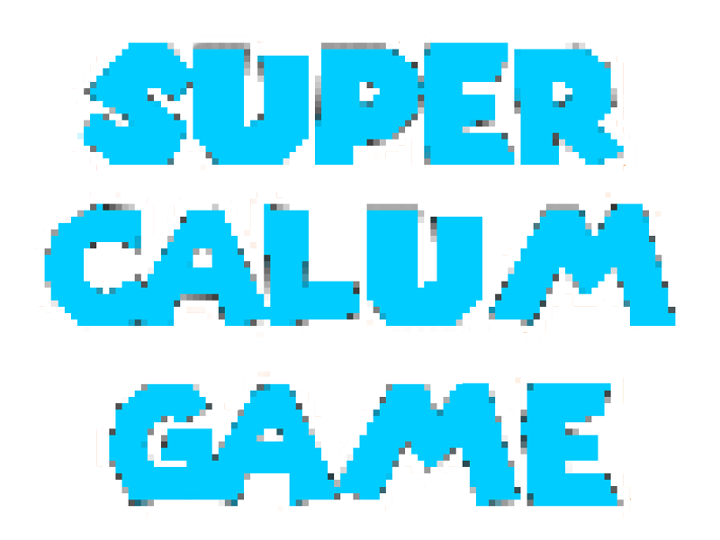
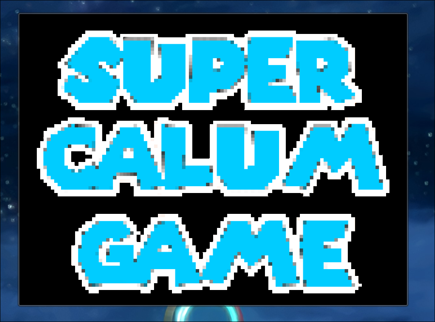
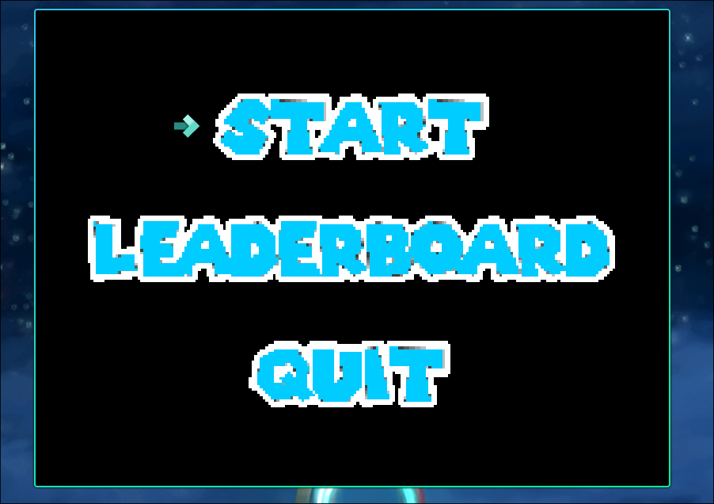
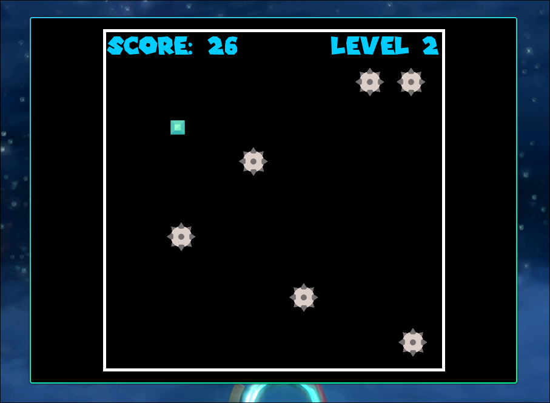
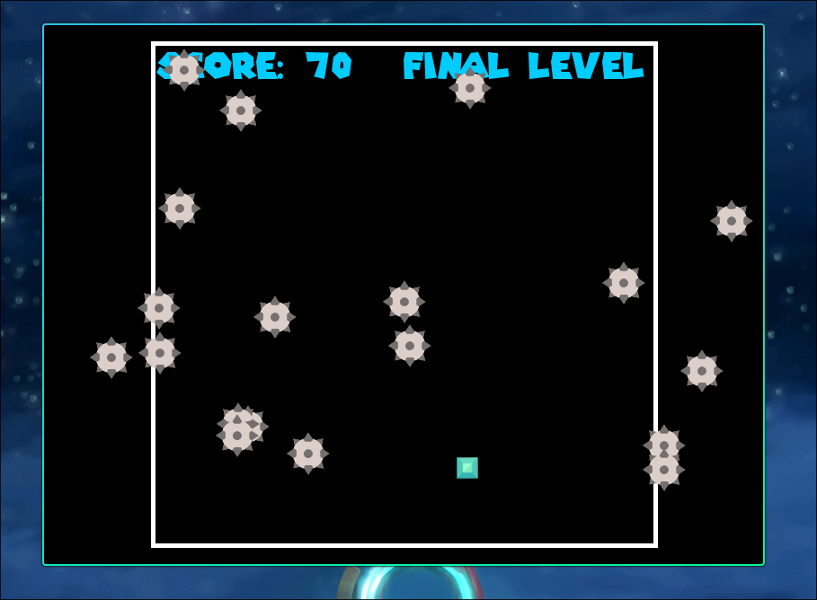
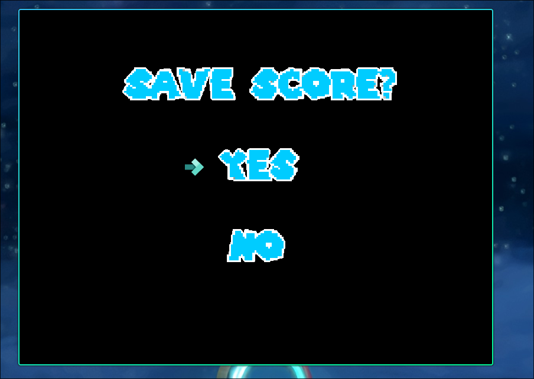
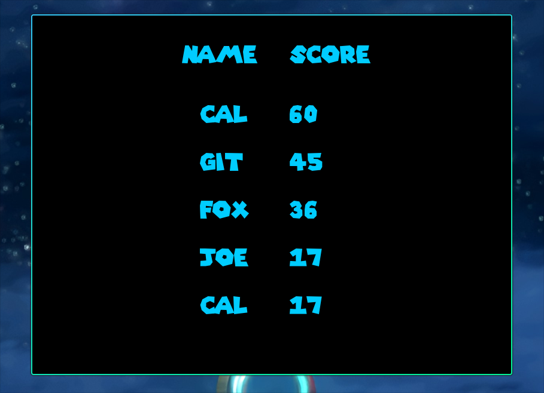

# Super Calum Game

Super Calum Game is a project I made inspired by Undertale for my Advanced Higher Computing Project for 2021-2022

## Screenshots

### Title Screen


### Main Menu


### Game Screen


### Final Level


### Save Screen


### Leaderboard



## Run

Create a virtual environment & install pygame
```bash

python -m venv venv
. venv/bin/activate

pip install pygame
python main.py
```

## Upkeep

I made this full project before uploading it to github, and am not planning on making any updates. As of June 2022, official development for Super Calum Game is concluded
